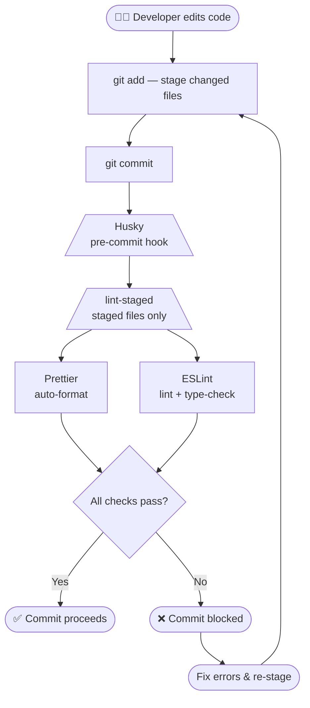

# 🏗️ Code Quality Workflow

<p align="right"><em>&lt;Last updated: 2026-05-27&gt;</em></p>

This guide walks through setting up and understanding the **automated code quality pipeline** used in this project.
The pipeline combines **Prettier**, **ESLint**, **Lint-Staged**, and **Husky** to enforce consistent formatting and
linting automatically on every commit — with zero manual effort after setup.

> ### 🗂️ Contents
>   - 🪐 [Overview](#-overview-)
>   - 🌱 [Installation](#-installation-)
>   - ⚙️ [Configuration](#-configuration-)

************

[⤴️ Back: **Development**](../-contents.md)

************


## 🪐 Overview [🔺](#-code-quality-workflow)

When a developer runs `git commit`, the following pipeline executes automatically:



**How each tool fits in:**

| Tool            | Role                                                                              |
|-----------------|-----------------------------------------------------------------------------------|
| **Husky**       | Intercepts Git events (e.g. `pre-commit`) and runs configured scripts             |
| **Lint-Staged** | Filters only the staged files and passes them to the formatters/linters           |
| **Prettier**    | Auto-formats code — changes are re-staged automatically if formatting is applied  |
| **ESLint**      | Checks rules and type safety — blocks the commit if violations are found          |

------------


## 1. Prettier

**Prettier** is an opinionated **code formatter**. It automatically rewrites source files to enforce a consistent
style — indentation, quotes, line length, trailing commas — with minimal configuration.


### ⓵. Install Packages

```shell
pnpm add -D prettier
```


### ⓶. Configure Formatting Rules

Create a `prettier.config.mjs` file in the project root:

```js
// (📍 /prettier.config.mjs)

/**
 * @see https://prettier.io/docs/options
 * @type {import('prettier').Config}
 */
const config = {
  semi: true,
  singleQuote: true,
  trailingComma: 'es5',
  bracketSpacing: true,
  tabWidth: 2,
  useTabs: false,
  printWidth: 120,
  arrowParens: 'avoid',
  endOfLine: 'auto',
  jsxSingleQuote: false,
  bracketSameLine: false,
};

export default config;
```

📙 For available configuration options, refer to [Prettier Format Options](../quality-tools/prettier.md#-format-options-).\
🚫 To exclude files from formatting, refer to [Ignoring Files on Prettier](../quality-tools/prettier.md#-ignore-files).

Add a formatting script to `package.json`:

```json5
// (📍 /package.json)

{
  "scripts": {
    "format": "prettier . --write"
  }
}
```

📙 The `format` script formats all supported files in the project.


### ⓷. Verify Formatter

Modify any source file so it violates the configured formatting rules.

📗 **Example (before formatting):**

```js
// ❌ Violates formatting rules: missing spacing and incorrect quote type
const message={text:"Hello world"}
```

Then run the formatter:

```shell
pnpm format
```

🎯 **Expected Result:** the file will be automatically reformatted according to the configured Prettier rules.

📗 **Example (after formatting):**

```js
// ✅ Cleanly formatted code
const message = { text: 'Hello world' };
```

------------


## 2. ESLint

**ESLint** is a **static analysis tool** for JavaScript and TypeScript. It catches code issues, enforces quality
rules, and — when paired with `typescript-eslint` — validates TypeScript-specific patterns and types.


### ⓵. Install Packages

The packages below provide the minimum setup required to use ESLint in a TypeScript project.

```shell
# Core linter + built-in JS rules
pnpm add -D eslint @eslint/js globals

# TypeScript support (if using TypeScript)
pnpm add -D typescript-eslint

# Disable ESLint style rules that conflict with Prettier
pnpm add -D eslint-config-prettier
```

Depending on your project's requirements, you may also install additional ESLint plugins or shared configurations:
  - Search [`eslint-plugin-*`](https://www.npmjs.com/search?q=eslint-plugin) on **npm** for ESLint plugins.
  - Search [`eslint-config-*`](https://www.npmjs.com/search?q=eslint-config) on **npm** in npm for shared configs.
  - Refer to [ESLint Popular Packages](../quality-tools/eslint-advanced.md#-popular-packages-) for commonly used packages.

Install additional packages as needed:

```shell
pnpm add -D <eslint-package> ...
```


### ⓶. Configure Linting Rules

Create an `eslint.config.mjs` file in the project root:

```js
// (📍 /eslint.config.mjs)

import { defineConfig, globalIgnores, includeIgnoreFile } from 'eslint/config';
import globals from 'globals';
import eslint from '@eslint/js';
import tseslint from 'typescript-eslint';
import prettierConfig from 'eslint-config-prettier';
import { fileURLToPath } from 'node:url';

const gitignorePath = fileURLToPath(new URL('.gitignore', import.meta.url));

/**
 * @type {import('eslint').Linter.Config[]}
 */
export default defineConfig(
  // Globally ignore files from .gitignore
  includeIgnoreFile(gitignorePath, { gitignoreResolution: true }),

  // Additional globally ignored files
  globalIgnores(['**/dist/', '**/build/']),

  {
    languageOptions: {
      // Define environment global variables
      globals: globals.nodeBuiltin,
    },
  },

  // Core ESLint JS rules
  eslint.configs.recommended,

  // Recommended TypeScript rules with type-checking
  tseslint.configs.recommendedTypeChecked,

  {
    languageOptions: {
      parserOptions: {
        // Enable tsconfig.json resolution
        projectService: true,
        tsconfigRootDir: import.meta.dirname,
      },
    },
  },

  // Disable type-checked rules for plain JS files
  {
    files: ['**/*.js'],
    extends: [tseslint.configs.disableTypeChecked],
  },

  // Disable ESLint rules that conflict with Prettier
  prettierConfig,

  // Additional plugins or shared configs
  // ...

  // Custom project rules
  {
    rules: {
      // ...
    },
  }
);
```

📙 How to configure ESLint is covered in [ESLint Configuration](../quality-tools/eslint.md#-configuration-).\
🚫 To include or exclude files, refer to [Scope and Ignore Settings](../quality-tools/eslint-advanced.md#-scope-and-ignore-settings-).

Add a linting script to `package.json`:

```json5
// (📍 /package.json)

{
  "scripts": {
    "lint": "tsc --noEmit && eslint ."
  }
}
```

📙 The `lint` script validates TypeScript types and runs ESLint across the project.


### ⓷ Verify Linter

Modify any source file so it violates the configured linting rules.

📗 **Example (before linting):**

```js
// ❌ Violates linting rules: unused variable
const unusedValue = 'hello';

// ❌ Violates linting rules: undefined variable & missing semicolon
console.log(message)
```

Run the linter:

```shell
pnpm lint
```

🎯 **Expected Result:** ESLint reports linting errors and warnings for the invalid code.

📗 **Example Output:**

```text
error  'unusedValue' is assigned a value but never used
error  'message' is not defined
warning  Missing semicolon
```

------------


## 3. Lint-Staged

**Lint-Staged** runs linters and formatters **only on files staged in Git**. This keeps pre-commit checks fast by
avoiding full-project scans on every commit.


### ⓵. Install Packages

```shell
pnpm add -D lint-staged
```


### ⓶. Configure Lint-Staged

Create a `lint-staged.config.mjs` file in the project root:

```js
// (📍 /lint-staged.config.mjs)

/**
 * @type {import('lint-staged').Configuration}
 */
const config = {
  '*.ts?(x)': () => 'tsc --noEmit',
  '*.{ts,tsx,js,mjs}': ['eslint', 'prettier --write'],
  '*.json': 'prettier --write',
}

export default config;
```

📙 For command formats, refer to [Lint-Stage Config Format](../gitflow-tools/lint-staged.md#-config-format-).

> ### ❗ Important
>
> The `format` and `lint` scripts in `package.json` are intended to run for the entire project.
>
> In contrast, commands in `lint-staged.config.mjs` executed only for staged files. **Lint-Staged** automatically
> detects staged files from Git and **appends those file paths to the configured commands**.
>
> 📗 **Example:**
>
> ```
> // - 📝 Configuration -
> "*.ts": "prettier --write"
>
> // - 🎯 Executed internally as -
> prettier --write file1.ts file2.ts ...
> ```
>
> Therefore, commands in `lint-staged.config.mjs` should:
>   - Be executable with file arguments.\
>     📗 **Example:**
>
> ```
> "*.ts": "eslint ." // ❌ Incorrect because it already includes a source path (`.`)
> "*.ts": "eslint"   // ✅ Correct
> ```
>
>   - Include all required options used in the corresponding scripts from `package.json`.\
>     📗 **Example:**
>
> ```
> // - 📝 If the `lint` script in `package.json` is -
> "lint": "eslint -c configs/eslint.config.mjs ."
>
> // - ✅ Then the Lint-Staged command should be -
> "*.ts": "eslint -c configs/eslint.config.mjs"
> ```


### ⓷ Verify Lint-Staged

Modify and stage a file that violates configured linting or formatting rules.

📗 **Example (before formatting/linting):**

```js
// ❌ Violates linting rules
const unusedValue = 'hello';

// ❌ Violates formatting rules
const message={text:"Hello world"}
```

Stage the file:

```shell
git add src/example.ts
```

Run **Lint-Staged** manually:

```shell
pnpx lint-staged
```

🎯 **Expected result:**
  - ESLint reports linting errors for invalid code.
  - Prettier automatically formats supported files.
  - Only staged files are processed by the configured commands.

------------


## 4. Husky

**Husky** is a **Git hook manager** — the entry point that triggers the entire pipeline. It intercepts Git
events such as `pre-commit` and runs the scripts you define.


### ⓵. Install Packages

```shell
pnpm add -D husky
```


### ⓶. Configure Husky

Initialize Husky:

```shell
pnpm exec husky init
```

`husky init` automatically:
  - Creates the `.husky/` directory.
  - Adds a `prepare` script to `package.json` so hooks install on every `pnpm install`.
  - Creates a default `.husky/pre-commit` hook file.

📙 For more details, refer to [Husky Configuration](../gitflow-tools/husky.md#-configuration-).


### ⓷ Configure Pre-Commit Validation

Edit the generated `.husky/pre-commit` file:

```shell
# (📍 /.husky/pre-commit)

pnpx lint-staged
```

This hook automatically runs `lint-staged` before every commit, allowing linting and formatting tasks to run only on
staged files.


### ⓸ Verify Git Hooks

Modify any source file so it violates the configured linting or formatting rules.

📗 **Example (before commit):**

```js
// ❌ Violates linting rules
const unusedValue = 'hello';

// ❌ Violates formatting rules
const message={text:"Hello world"}
```

Stage the file and create a commit:

```shell
git add .
git commit -m "test husky hook"
```

🎯 **Expected result:** Husky automatically runs the `pre-commit` hook and blocks the commit because `lint-staged`
detects errors in the staged files.
